<div align="center">

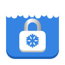

# Permafrost

**Block distracting websites and apps until the timer runs out.**

A focus app for the GNOME desktop, in the spirit of Cold Turkey. Lock a freeze and it can't be stopped early — not by closing the app, not by restarting your computer.

[](LICENSE)


[](https://paypal.me/atayozc)

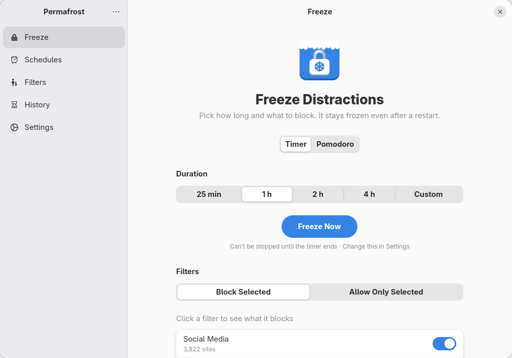

</div>

## What it helps with

| | |
|---|---|
| Waste less time on YouTube | A **daily limit** on the Video filter, like 30 minutes a day |
| Set healthy gaming limits | A daily limit on Games, which closes Steam and other launchers when time's up |
| Block adult websites | The Adult Content filter with community lists, on an **all-day schedule** |
| Avoid gambling | The Gambling filter, with 140,000+ sites from community lists |
| Curb impulse purchases | The Shopping filter during work hours |
| Cut back on food delivery | The Food Delivery filter in the evenings |
| Prevent doomscrolling | Social Media and News, frozen or limited |
| Go to bed on time | An overnight schedule, locked until morning |
| Study for exams | **Allow Only** your course sites and apps; everything else is blocked |
| Increase productivity | **Pomodoro** rounds with short and long breaks |

## Features

### Freeze, as a timer or in Pomodoro rounds

Freeze for 25 minutes, 1, 2 or 4 hours, or a custom time like **1:30**. Or switch to **Pomodoro**: pick the number of rounds, the focus length, and short and long breaks. Blocks lift during breaks, and notifications tell you when each round starts.

<p align="center">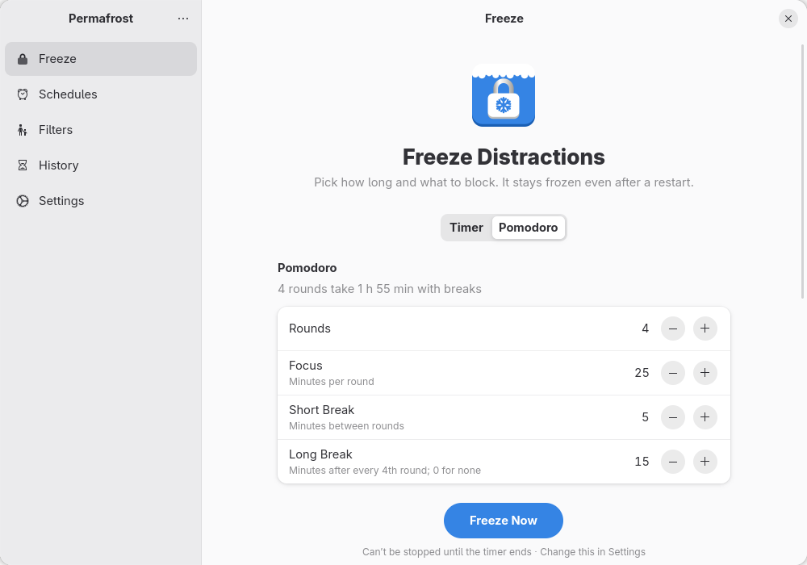</p>

### Locks that hold

A locked freeze can't be stopped early, only extended. While it runs, its filters can only get stricter: you can add sites, never remove them. Blocks survive restarts and stopping the service, and changing the system clock doesn't end a freeze.

<p align="center">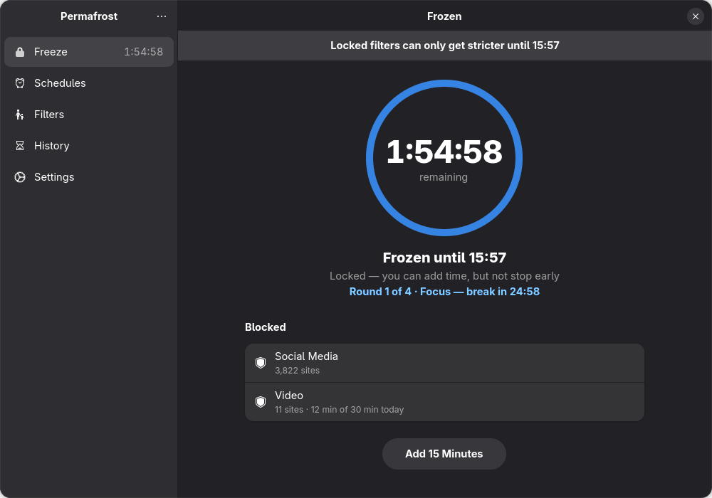</p>

### Filters, with hundreds of thousands of sites

Built-in filters for social media, video, news, shopping, food delivery, games, gambling, adult content and harmful sites, plus your own. Each holds websites, apps and **community lists** from [StevenBlack/hosts](https://github.com/StevenBlack/hosts), [HaGeZi](https://github.com/hagezi/dns-blocklists) and [The Block List Project](https://github.com/blocklistproject/Lists), including one that blocks VPNs, proxies and encrypted DNS services that could get around Permafrost. Blocked apps, Flatpaks included, are closed as soon as they open.

| | |
|---|---|
| 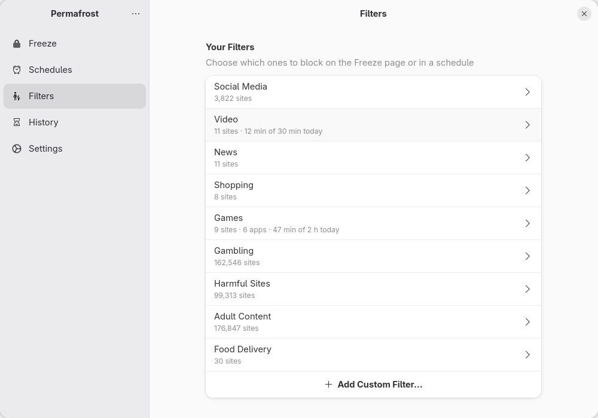 | 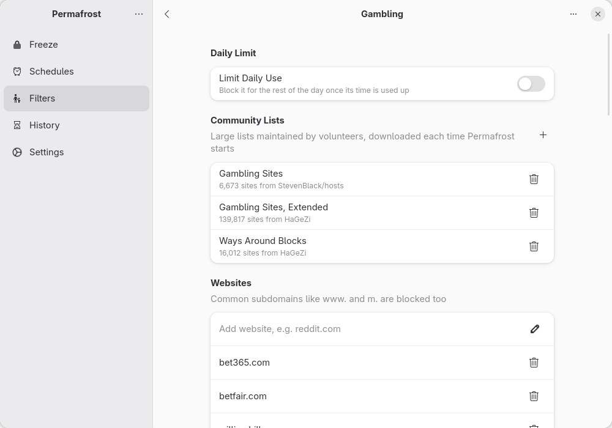 |

### Allow only what you need

Flip a freeze to **Allow Only Selected** and every website and app outside the chosen filters is blocked — ideal for studying with just your course sites and a text editor.

<p align="center">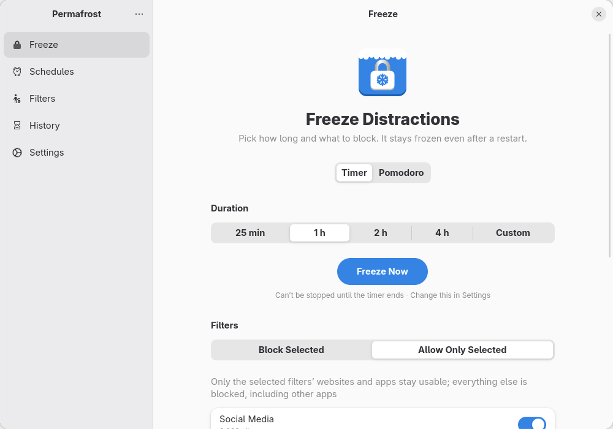</p>

### Daily limits

Give a filter a daily limit. Permafrost counts the time its websites and apps are in use, and once the time is up, the filter is blocked and locked until midnight.

<p align="center">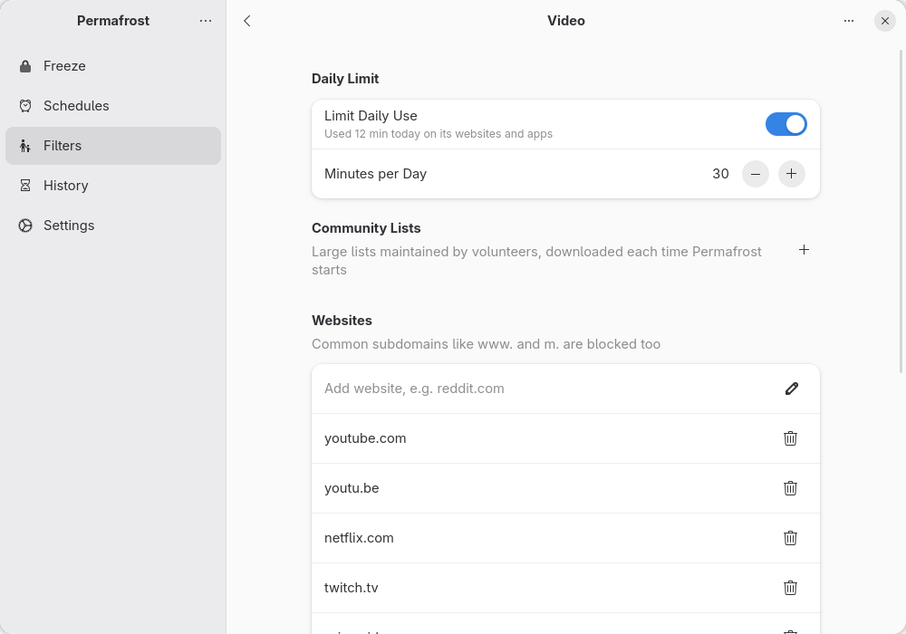</p>

### Schedules, History and Settings

Schedules block filters automatically at set hours or all day. History shows your focus time day by day and your streak. Settings has the default lock, **Force SafeSearch** for Google, Bing, DuckDuckGo and YouTube, and Restore Defaults.

| | | |
|---|---|---|
| 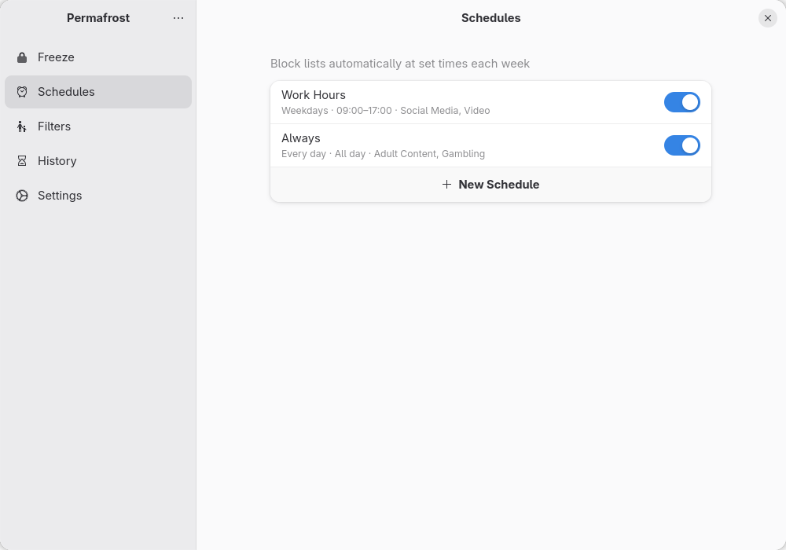 | 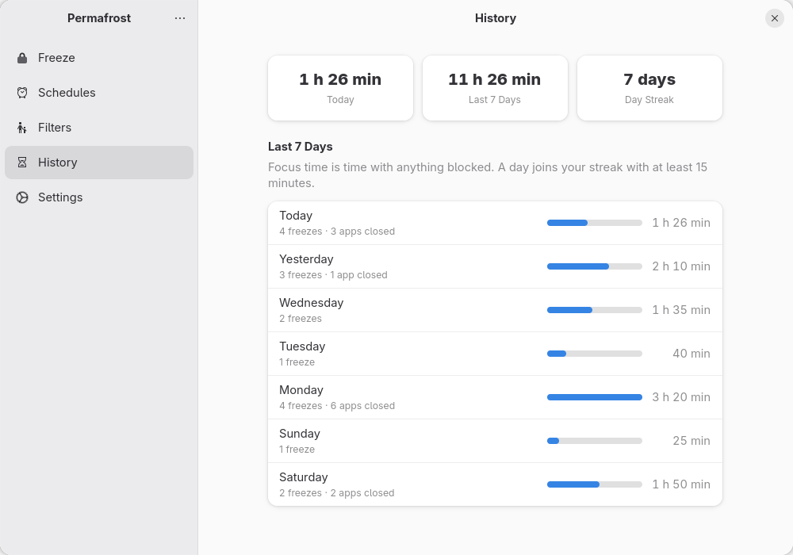 | 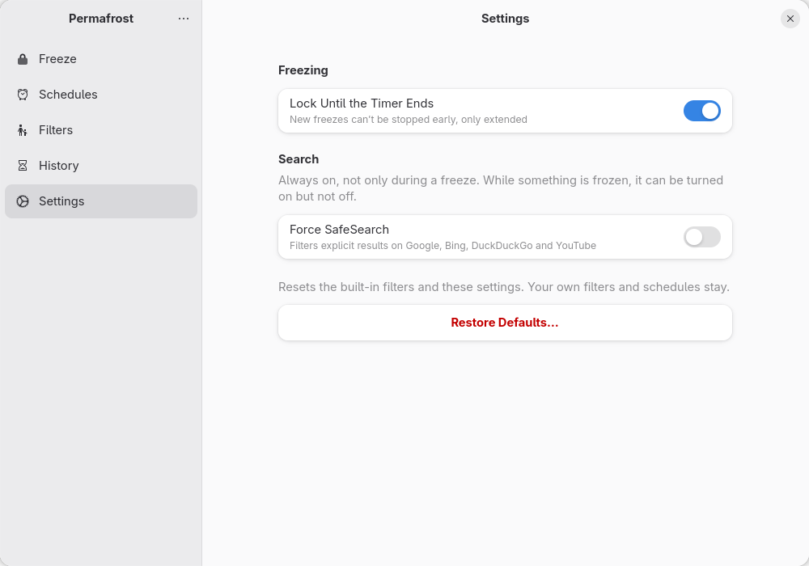 |

## Installation

Permafrost needs a system service to edit `/etc/hosts`, filter DNS and close apps, so it's installed system-wide rather than as a Flatpak.

**Requirements:** a Linux desktop with GNOME 50 or newer (libadwaita 1.9, GTK 4.22), systemd, systemd-resolved, nftables and Rust 1.92 or newer. On Fedora 44:

```sh
sudo dnf install gtk4-devel libadwaita-devel blueprint-compiler glib2-devel
```

Then build and install. The script builds as you and only asks for your password to install:

```sh
git clone https://github.com/atayoez/permafrost.git
cd permafrost
./install.sh
```

This installs the app, the `permafrostd` service, its D-Bus policy, the desktop file and icons, and starts the service. Open **Permafrost** from your apps.

To update, pull and run `./install.sh` again. To remove it:

```sh
./install.sh --uninstall
```

Your filters, schedules and history stay in `/var/lib/permafrost` until you delete that folder.

## How it works

```
┌─────────────── your session ───────────────┐
│  Permafrost app (GTK 4 + libadwaita, Rust) │
└────────────────────┬───────────────────────┘
                     │ D-Bus system bus: io.github.atayoez.Permafrost1
┌────────────────────┴───────────────────────┐
│  permafrostd (systemd service, root)       │
│   ├─ /etc/hosts      blocks websites       │
│   ├─ DNS filter      allowlists, limits    │
│   ├─ app scopes      closes blocked apps   │
│   ├─ browser policy  turns off DoH         │
│   └─ /var/lib/permafrost  state + lists    │
└────────────────────────────────────────────┘
```

- **The service owns every rule.** The app never runs as root; it only asks `permafrostd` for changes, and the service refuses anything that would loosen a lock. Closing or killing the app changes nothing.
- **Websites** are blocked through a managed section of `/etc/hosts`, which every browser and app respects. Common subdomains (`www.`, `m.`, …) are blocked along with each site, and community lists are written as IPv4-only lines to keep the file small.
- **The DNS filter** is a small forwarder in the service, used for allowlists and website time limits. While it's needed, an nftables rule sends systemd-resolved's lookups to it, with one port per upstream server and each query sent out of the same network interface, so split DNS (VPNs, Tailscale) keeps working. Your DNS settings are never edited, and the rule is removed when it's no longer needed or the service stops, even after a crash.
- **Apps** are found through the systemd scope GNOME starts every app in (`app-gnome-…scope`, `app-flatpak-…scope`) and closed with `cgroup.kill`. Apps started some other way are matched by their executable.
- **Encrypted DNS** (DNS-over-HTTPS) would skip all of this, so while anything is blocked the service installs managed policies that turn it off in Firefox, Chrome, Chromium, Brave and Edge, and removes them afterwards. It never touches a policy file it didn't create. Browsers pick the policy up when they start.
- **Clock changes** don't end freezes early: the service measures elapsed time with the boot clock and shifts the end time if the wall clock jumps.

> [!NOTE]
> Permafrost aims for "just enough friction", not a fortress. Anyone with root access can undo it. Its job is to make breaking a freeze slow and deliberate, not impossible.

## Development

The workspace has three crates:

| Crate | What it is |
|---|---|
| `crates/common` | The model, presets, community list sources and the D-Bus proxy |
| `crates/daemon` | `permafrostd`, the system service |
| `crates/app` | The GTK app; its UI is in `crates/app/data/ui/*.blp` ([Blueprint](https://gnome.pages.gitlab.gnome.org/blueprint-compiler/)) |

Run the tests and lints:

```sh
cargo test --workspace
cargo clippy --workspace --all-targets
```

Try everything without root or touching your system: run the service on the session bus in dry-run mode, and point the app at it.

```sh
cargo run -p permafrostd -- --session --dry-run --state-dir /tmp/permafrost --hosts /tmp/permafrost/hosts
PERMAFROST_BUS=session cargo run -p permafrost
```

`--dry-run` logs what would be blocked instead of writing `/etc/hosts`, firewall rules or browser policies, or closing apps. The DNS filter still listens, on ports 5300 and up (one per upstream server), so you can query it directly:

```sh
dig @127.0.0.1 -p 5300 example.com
```

If the real service ever leaves DNS broken, `sudo nft delete table inet permafrost_dns` turns the filter's redirect off.

Debug builds can render the window to a PNG and quit, which is how the screenshots above were made:

```sh
PERMAFROST_BUS=session PERMAFROST_SCREENSHOT=out.png PERMAFROST_SECTION=filters cargo run -p permafrost
```

`PERMAFROST_SECTION` takes `schedules`, `filters`, `history`, `settings`, `custom`, `pomodoro`, `allow`, `list:<id>` or `preview:<id>`. Set `ADW_DEBUG_ACCENT_COLOR=blue` and `ADW_DEBUG_COLOR_SCHEME=prefer-dark` to control the look.

### D-Bus interface

`permafrostd` serves `io.github.atayoez.Permafrost1` at `/io/github/atayoez/Permafrost1` on the system bus. Structured values are JSON strings (see `crates/common/src/model.rs`).

| Method | Arguments |
|---|---|
| `GetStatus` | → status JSON |
| `SaveList` / `DeleteList` | block list JSON / id |
| `SaveSchedule` / `DeleteSchedule` | schedule JSON / id |
| `SetSettings` | settings JSON |
| `RestoreDefaults` | |
| `StartFreeze` | list ids, seconds, locked, Pomodoro breaks JSON (empty for none), allow only |
| `AddTime` / `StopFreeze` | seconds / — |

Signals: `StatusChanged(status)` and `AppBlocked(app_id, until)`. Calls that would loosen a lock fail with `org.freedesktop.DBus.Error.AccessDenied`.

## Support

Permafrost is free and always will be. If it helps you focus, you can support its development:

[](https://paypal.me/atayozc)

Bug reports and ideas are welcome in [Issues](https://github.com/atayoez/permafrost/issues).

## Credits

- Community lists by [Steven Black](https://github.com/StevenBlack/hosts) (MIT), [HaGeZi](https://github.com/hagezi/dns-blocklists) (GPL-3.0) and [The Block List Project](https://github.com/blocklistproject/Lists) (Unlicense). Permafrost downloads them from their projects; they aren't bundled.
- Built with [GTK](https://gtk.org), [libadwaita](https://gnome.pages.gitlab.gnome.org/libadwaita/), [gtk-rs](https://gtk-rs.org), [zbus](https://github.com/dbus2/zbus), [hickory-dns](https://github.com/hickory-dns/hickory-dns) and [ashpd](https://github.com/bilelmoussaoui/ashpd).
- Inspired by [Cold Turkey](https://getcoldturkey.com), which doesn't run on Linux.

## License

Permafrost is free software under the [GNU General Public License v3.0 or later](LICENSE).
